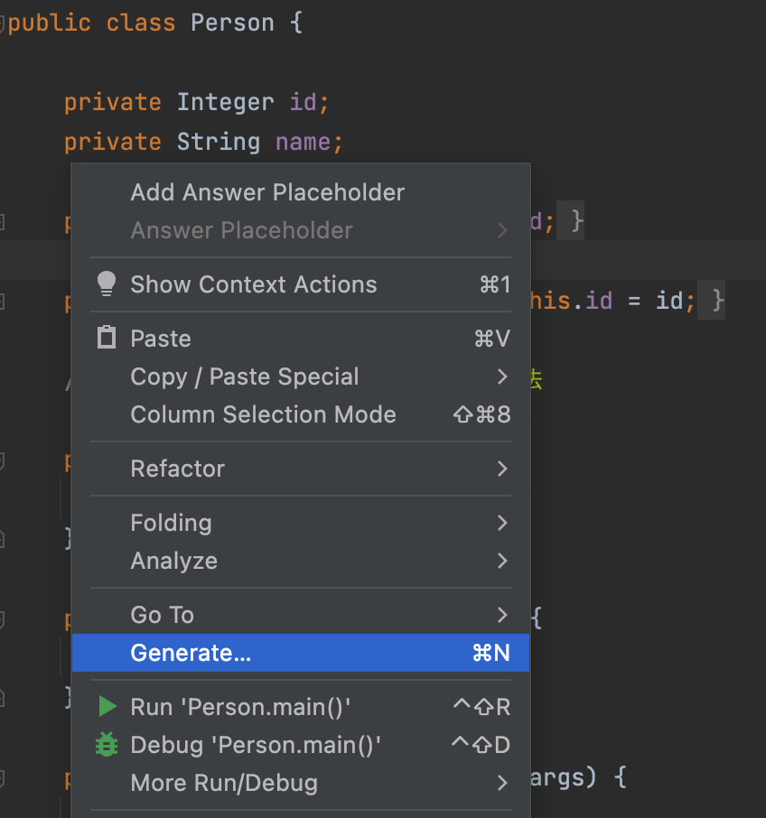
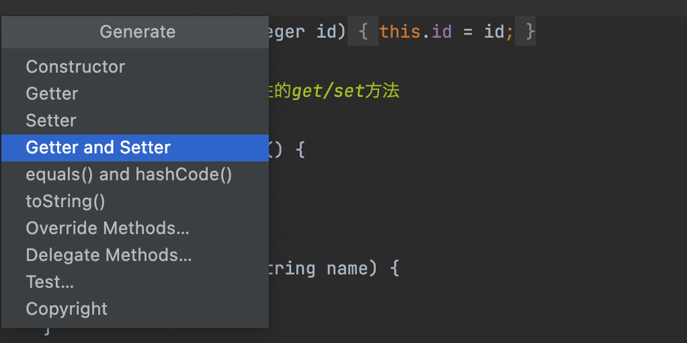
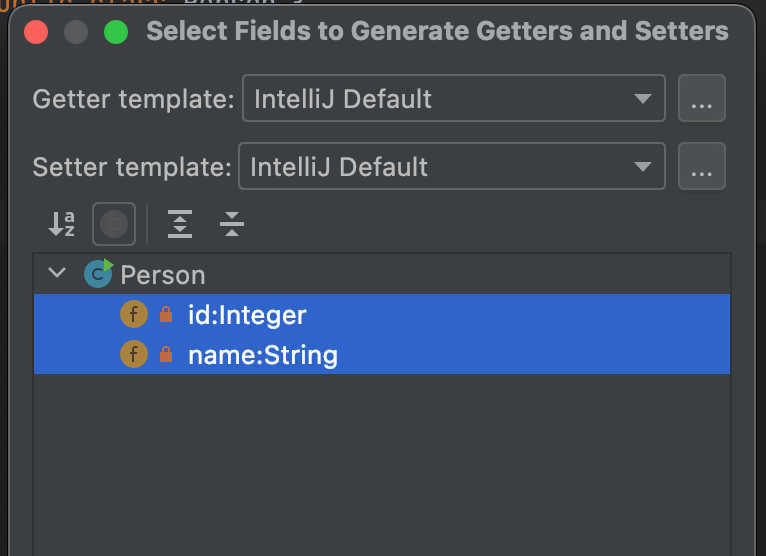
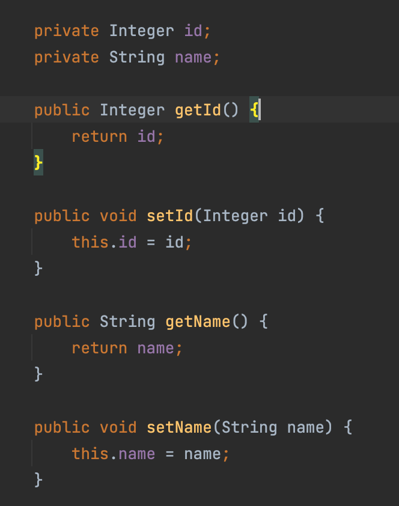

# 公主的信息你别问，公主的事你少管！

---

<br>

## Encapsulation 封装性

- 声明一个类，将属性私有化`private`，并提供公有化`public`的访问方法，
或者说**用公有方法访问对象的私有属性**
- 封装性有普遍的现实意义：例如一人的姓名是私有信息，并非是暴露无遗的，
但是在特定的场景下可以允许外部访问，如询问姓名、登记姓名等
- 在面向对象中，封装性保证了类/对象的属性信息是私密、稳定的

<br>

## Getter/Setter 访问方法

- Getter/Setter是Java的约定规则，同样遵循"驼峰"式方法命名
- Getter表示获取属性值，Setter表示设置、变更属性值
- 通常情况下Getter/Setter成对存在

```java

    private Integer id;

    public Integer getId() {
        return id;
    }

    public void setId(Integer id) {
        this.id = id;
    }

```

- 规范化定义访问方法也是运用Spring、MyBatis等框架的基础
- 访问方法是约定俗成的，编译器提供了生成访问方法的快捷方式









<br>

---

<br>

***- 小CASE -***

**1. 观察创建对象的过程和打印输出，并思考这个过程发生了什么。**

**2. 完善`Animal`类的属性、访问方法并调用**

<br>

---

_关注全网ID：**@老刘大数据** 版权所有_

_更多课程资源：692000925@qq.com_