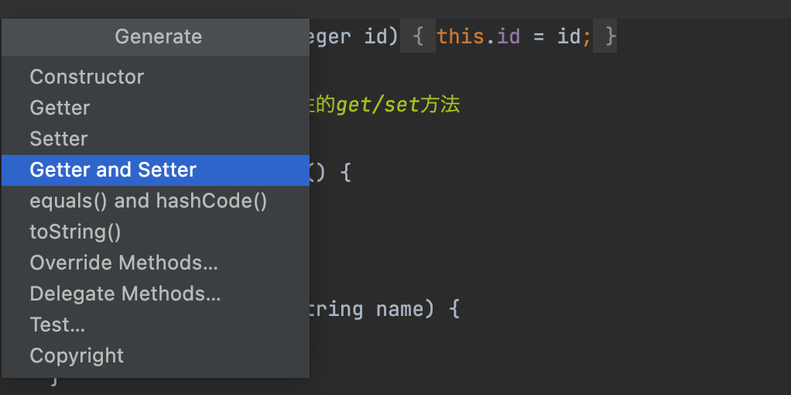
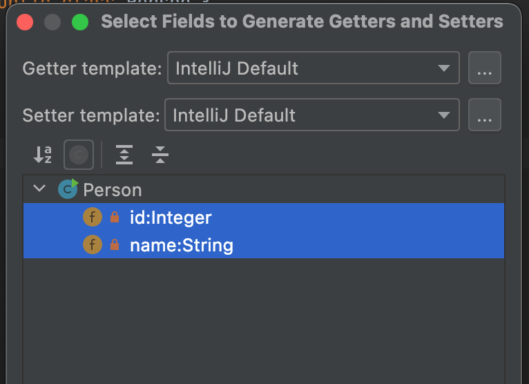
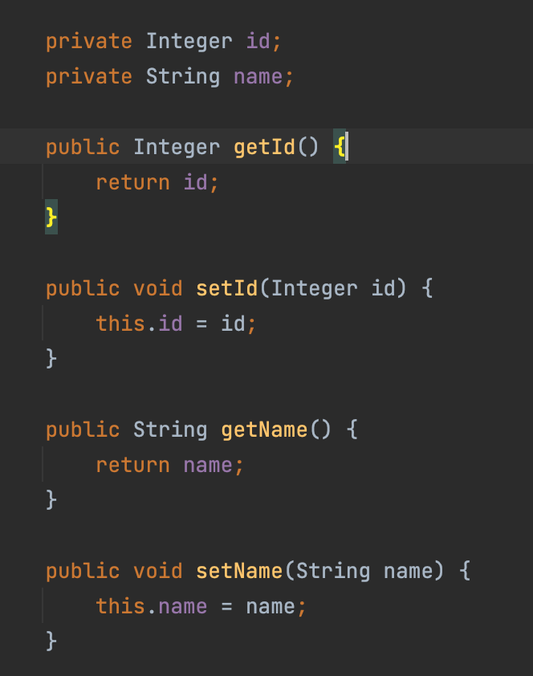

# Do Not Ask About the Princess's Information, Mind Your Own Business!

---

<br>

## encapsulation

- Declare a class, make attributes private `private`, and provide public `public` access methods, or in other words, **use public methods to access an object's private attributes**.
- Encapsulation has universal real-world significance: for example, a person's name is private information and not fully exposed, but it can be accessed externally in certain situations, such as asking for a name, registering a name, etc.
- In object-oriented programming, encapsulation ensures that the attributes of a class/object are private and stable.

<br>

## getter/setter methods

- Getter/Setter are conventions in Java, and they also follow "camelCase" method naming.
- A Getter retrieves attribute values, while a Setter sets or changes attribute values.
- Usually, Getter/Setter methods exist in pairs.

```java

    private Integer id;

    public Integer getId() {
        return id;
    }

    public void setId(Integer id) {
        this.id = id;
    }

```

- Defining access methods in a standardized way is also fundamental for using frameworks like Spring, MyBatis, etc.
- Access methods are conventional, and the compiler provides shortcuts for generating these methods.








<br>

---

<br>

***- Small CASE -***

**1. Observe the process of creating an object and printing output, and consider what happens during this process.**

**2. Improve the properties and access methods of the `Animal` class and call them.**

<br>

---

_Follow the All-Web ID: **@老刘大数据** All Rights Reserved_

_More course resources: 692000925@qq.com_