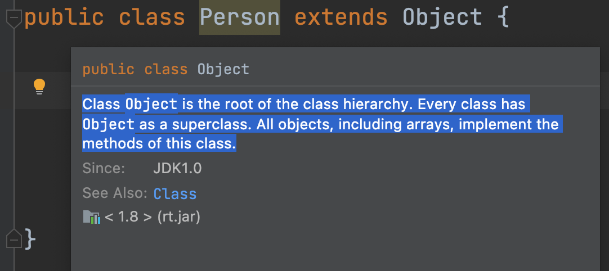
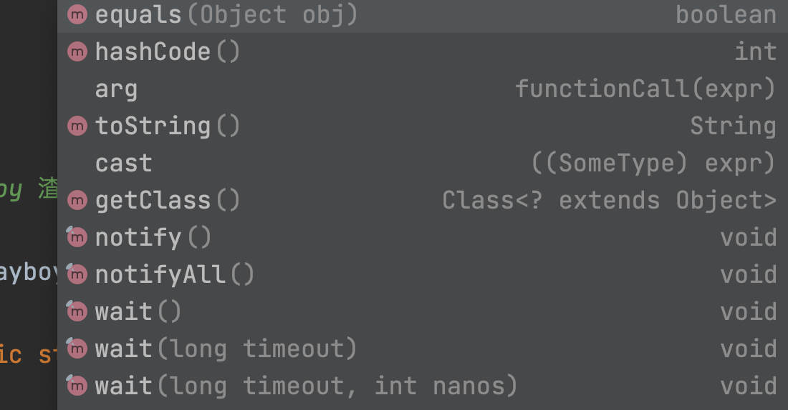

# 学好Java，不愁对象

---

 

## `Object` —— 对象类，万类之源

引用JDK的官方解释：

_Class Object is the root of the class hierarchy. Every class has Object as a superclass. All objects, including arrays, implement the methods of this class._

- `Object`类是类继承的**根**
- `Object`类是所有类的父类（超类）
- 一切对象都实现了`Object`类的方法，包括arrays/数组

 

基于以上定义结合继承性，在编程过程中可扩展出：

- Java是**单继承关系**，一个类只能声明继承自一个类或者不声明继承（默认继承`Object`）
- 任意类，不论是否声明`extends Object`，都会默认继承`Object`，所以这个继承关系不需要声明

 

## `new Object();` 对象类的对象

`Object` 类是一个普通的非抽象类，当然可以创建该类的对象。即

`Object object = new Object();`

 

因为它是一切对象的类，包含对象最高级别的通用方法，`Object` 类的方法不多，不常用，但是覆盖面非常广，就像"宪法"一样赋予了Java世界中所有对象的基本权利。

 

---

 

***- 小CASE -***

**1. 思考Java为什么要设计一个`Object`根类，这样做有什么好处？如果没有根，会发生什么？**

 

---

_关注全网ID：**@老刘大数据** 版权所有_

_更多课程资源：692000925@qq.com_