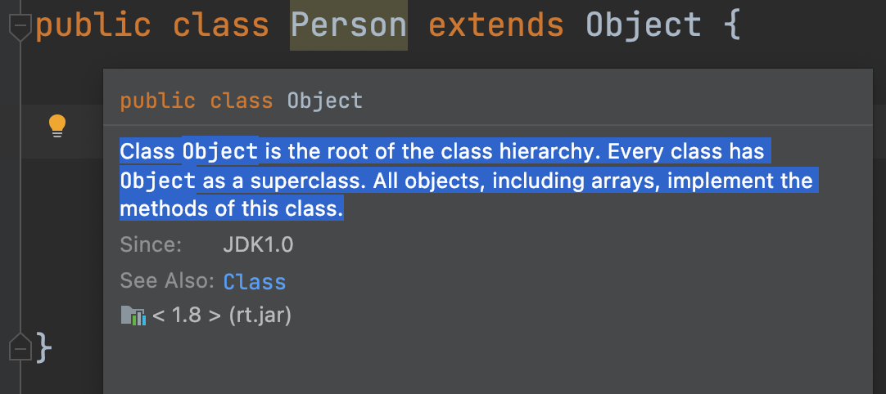
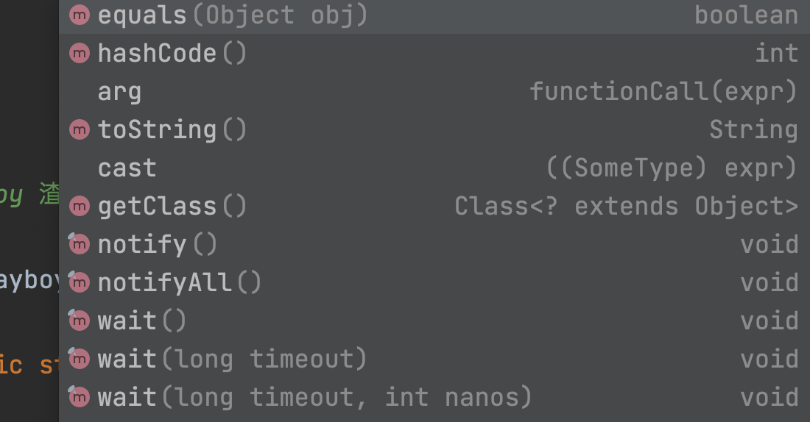

# Mastering Java, No Worries About Objects

---

 

## `Object` — The Object class, the source of all classes

Referencing the official JDK explanation:

_Class Object is the root of the class hierarchy. Every class has Object as a superclass. All objects, including arrays, implement the methods of this class._

- The `Object` class is the **root** of class inheritance
- The `Object` class is the superclass (parent class) of all classes
- All objects implement the methods of the `Object` class, including arrays

 

Based on the above definition and inheritance, in the programming process we can derive:

- Java follows a **single inheritance** model, where a class can only declare inheritance from one class or declare no inheritance (defaulting to inherit `Object`)
- Any class, whether or not it explicitly declares `extends Object`, will by default inherit from `Object`, so this inheritance relationship doesn't need to be declared

 

## `new Object();` Object class instance

The `Object` class is a regular non-abstract class, and it is certainly possible to create an instance of this class. That is:

`Object object = new Object();`

 

Since it is the class of all objects, containing the most general methods at the highest level, the methods of the `Object` class are few and not frequently used, but they have a very broad scope, like a "constitution" that grants basic rights to all objects in the Java world.

 

---

 

***- Small Case -***

**1. Consider why Java was designed to have an `Object` root class. What are the benefits of this? What would happen if there were no root class?**

 

---

_Follow the global ID: **@老刘大数据** All Rights Reserved_

_More course resources: 692000925@qq.com_