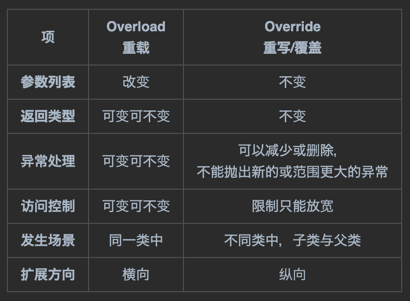

# 一个更广，一个更深

---

 

重载和重写是面向对象中重要的概念，需要对比加深理解记忆：

 

|    项     |     Overload 重载     |     Override 重写/覆盖      |
|:--------:|:-----------------------:|:---------------------------:|
| **参数列表** |           改变            |             不变              |
| **返回类型** |          可变可不变          |             不变              |
| **异常处理** |          可变可不变          | 可以减少或删除， 不能抛出新的或范围更大的异常 |
| **访问控制** |          可变可不变          |           限制只能放宽            |
| **发生场景** |          同一类中           |         不同类中，子类与父类          |
| **扩展方向** |           横向            |             纵向              | 

 

 

**相同点**：都是“相同”的方法，方法名相同，但表现形式不同

 

- 重载的“打”方法：描述广度，打电话，打车，打饭，打人
- 重写的“打”方法：描述深度，父类打电话，子类打电话，子类继承父类

 

---

 

***- 小CASE -***

**1. 仔细观察前两节案例代码，对比 重载Overload 和 重写Override 的异同。**

**2. 思考 重载Overload 和 重写Override 的本质是什么，为什么需要这样做？**

**3. （选做）运用所学词汇知识，尝试翻译以下表格内容：**

| No. | Method Overloading	                                                                                                                                                                                | Method Overriding                                                                                                           |
|-----|----------------------------------------------------------------------------------------------------------------------------------------------------------------------------------------------------|-----------------------------------------------------------------------------------------------------------------------------|
| 1   | Method overloading is used to increase the readability of the program.                                                                                                                             | Method overriding is used to provide the specific implementation of the method that is already provided by its super class. |
| 2   | Method overloading is performed within class.	                                                                                                                                                     | Method overriding occurs in two classes that have IS-A (inheritance) relationship.                                          |
| 3   | In case of method overloading, parameter must be different.	                                                                                                                                       | In case of method overriding, parameter must be same.                                                                       |
| 4   | Method overloading is the example of compile time polymorphism.	                                                                                                                                   | Method overriding is the example of run time polymorphism.                                                                  |
| 5   | In java, method overloading can't be performed by changing return type of the method only. Return type can be same or different in method overloading. But you must have to change the parameter.	 | Return type must be same or covariant in method overriding.                                                                 |

https://www.javatpoint.com/method-overloading-vs-method-overriding-in-java

 

---

_关注全网ID：**@老刘大数据** 版权所有_

_更多课程资源：692000925@qq.com_