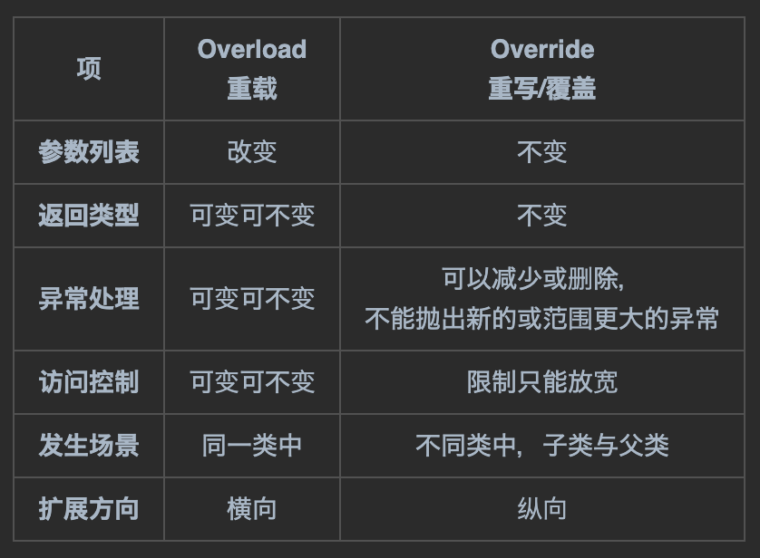

# broader and deeper

---

 

Overloading and overriding are important concepts in object-oriented programming. Comparing them can deepen understanding and memory:

 

|    Item   |     Overload     |     Override    |
|:--------:|:----------------:|:---------------:|
| **Parameter List** |        Change       |       No change     |
| **Return Type** | Can change or not |       No change     |
| **Exception Handling** | Can change or not | Can reduce or remove,  cannot throw new or broader exceptions |
| **Access Control** | Can change or not |  Restrictions can only be loosened |
| **Occurrence Scenario** |    Within the same class   | Between different classes, subclass and parent class |
| **Expansion Direction** |      Horizontal     |        Vertical      |

 

 

**Commonality**: They are both "same" methods with the same name but different forms

 

- Overloaded "hit" method: Describes breadth, make a call, call a cab, serve food, hit someone
- Overridden "hit" method: Describes depth, parent class makes a call, subclass makes a call, subclass inherits parent class

 

---

 

***- Small CASE -***

**1. Carefully observe the sample codes from the previous two sections. Compare the similarities and differences between overload and override.**

**2. Reflect on the essence of overload and override. Why is this necessary?**

**3. (Optional) Using the vocabulary knowledge learned, try translating the table content below:**

| No. | Method Overloading	                                                                                                                                                                                | Method Overriding                                                                                                           |
|-----|----------------------------------------------------------------------------------------------------------------------------------------------------------------------------------------------------|-----------------------------------------------------------------------------------------------------------------------------|
| 1   | Method overloading is used to increase the readability of the program.                                                                                                                             | Method overriding is used to provide the specific implementation of the method that is already provided by its super class. |
| 2   | Method overloading is performed within class.	                                                                                                                                                     | Method overriding occurs in two classes that have IS-A (inheritance) relationship.                                          |
| 3   | In case of method overloading, parameter must be different.	                                                                                                                                       | In case of method overriding, parameter must be same.                                                                       |
| 4   | Method overloading is the example of compile time polymorphism.	                                                                                                                                   | Method overriding is the example of run time polymorphism.                                                                  |
| 5   | In java, method overloading can't be performed by changing return type of the method only. Return type can be same or different in method overloading. But you must have to change the parameter.	 | Return type must be same or covariant in method overriding.                                                                 |

https://www.javatpoint.com/method-overloading-vs-method-overriding-in-java

 

---

_Follow the entire network ID: **@老刘大数据** All rights reserved_

_More course resources: 692000925@qq.com_